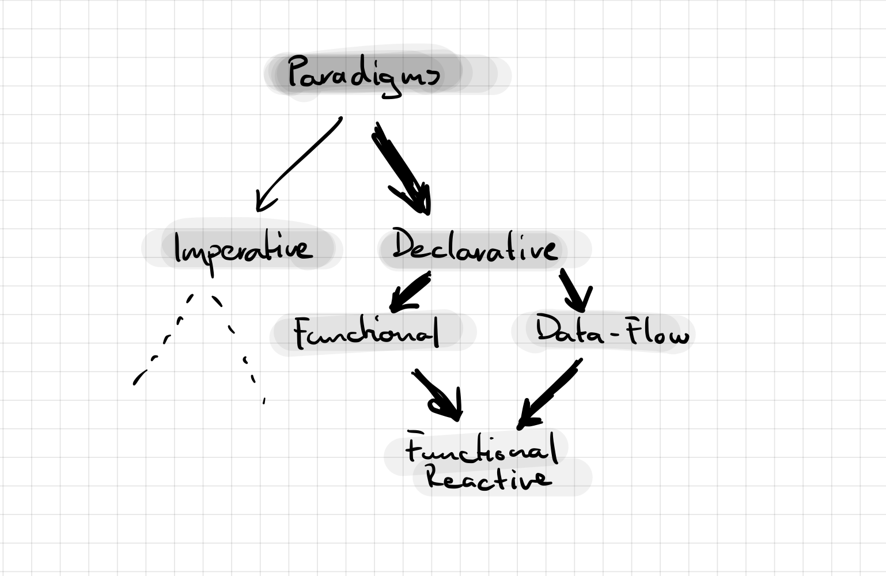

# Introduction

Debugging is an important part of a software engineers daily job. Various techniques, some better suited for the task than others, help engineers to explore the functionality of an unknown program. Rather traditional debugging is done by the interpretation of memory dumps or the analysis of log entries.  Modern debugging solutions hook into a program at runtime and allow more involved inspection and control.

Imperative programming languages like Java, C#, or Python dominated the mainstream software engineering industry over the last decades [@CITE]. Because of the prevalence of imperative programming langugaes, integrated development environments (IDE) like Eclipse, Idea, or Visual Studio provide specialized debugging utilities specifically tailored to imperative programming languages. This results in an excellent, fully integrated developer experience, where tool supported debugging is only one or two clicks away.

This experience degrades rapidly when software engineers start using programming languages and tools based on different programming paradigms. Because traditional debugging utilities apparently cannot provide answers to what engineers are interested in, engineers tend to use simpler debugging techniques instead.

Within the scope of my master studies research, I examined the necessity of paradigm-specific debugging utilities, when software engineers debug programs based on RxJS^[https://rxjs.dev/], a functional reactive programming library for JavaScript. During my research, I explored how professionals debug RxJS programs, what tools and techniques they employ, and why most of them prefer to use print statements instead of specialized debugging utilities. In doing so, I identified a key factor for the success of a debugging tool: It needs to be "ready to hand", or its users will not use it at all.

Based on the premise of "readiness to hand", I developed a practical debugging tool for reactive programming with RxJS, which makes manual print statements in this context obsolete.

In this summative thesis, I consolidate my research results documented and published in two research papers. I will complete this introduction with an overview on relevant programming paradigms, the specific debugging challenges they carry, and a glance on reactive programming with RxJS. Relevant work will be discussed in [@sec:related-work], followed by an overview on the full research process and its results in [@sec:research-process]. [@sec:future-work] presents a list of opportunities for future work and highlights provisions taken to ensure sustainability of the demonstrated results. Before the reader is left with the study of the research papers in the appendix, I will wrap up on the topic of debugging support for reactive programming with RxJS in [@sec:conclusion].

## Programming Paradigms

A program implemented in an imperative language (e.g., Java or C#) modifies implicit state using side-effects, achieved with assignment and various flow control statements like `while` or `if` [@Hudak_1989]. With a declarative programming language, computational results (i.e., state) are carried explicitly from one unit of the program to the next [@Hudak_1989]. The source code of a declaratively implemented program is the blueprint of *what* the program is expected to accomplish eventually, whereas its imperative sibling resembles the precise step-by-step instruction on *how* the expected result must be achieved.

The Functional (FP) as well as the Data-Flow Programming (DFP) paradigm belongs to the family of declarative languages.

FP languages (e.g., Haskell or Erlang) are based on the concept of expression evaluation: Flow control statements are replaced with recursive function calls and conditional expressions [@Hudak_1989]. Thus, a programs final outcome is the result of its full evaluation rather than its implicit state. With DFP, a program is modeled as a directed graph where a node represents an instruction of the program. The graph's edges describe how the data flows between its nodes [@Johnston_Hanna_Millar_2004]. Examples for DFP can be found in visual programming environments like Node-RED^[https://nodered.org/].

NEEDS A REVISION! FRP !== RP

Functional Reactive Programming (FRP) [@Wan_Hudak_2000] combines FP and DFP in order to describe Software engineers describe a data-flow graph using Domain Specific Languages (DSL) enabled by FP. DFP provides the execution model to process data using that graph accordingly. These two components are often not integrated within a programming language itself. Instead, optional libraries (e.g., REScala for Scala [@Salvaneschi_Hintz_Mezini_2014] or RxJS for JavaScript) provide FRP functionality to them.

## Debugging Concepts

## Reactive Programming with RxJS

RxJS is the JavaScript-based implementation of the ReactiveX API specification. The core concept of this API, the *Observable*, is "[..] a combination of the best ideas from the Observer pattern, the Iterator pattern, and functional programming"[@reactivex]. Like the Observer pattern [@gof], is the *Observable* an abstraction for notifying observers about changed state of the subject. 

# Related Work {#sec:related-work}

- Main
	- Salvaneschi [@Salvaneschi_Mezini_2016]
	- Banken [@Banken_Meijer_Gousios_2018]
	- Alabor [@Alabor_Stolze_2020]
- Other sources which might be interesting, but did not make it into my own papers.
- More recent research/products since the latest paper?
	- https://www.replay.io
	- ... others?

# Research Process {#sec:research-process}

- Find the right abstraction level for this section!
	- Necessary to go "deep"?
	- Keep bullets only?
	- Use some graphical representation of the process?
		- Timeline?
	- Highlight main aspects of different project phases:
		- HCI / UCD
		- Empirical Software Engineering

- Interviews
- War stories
- Remote observational study
- *First paper published *[@Alabor_Stolze_2020]
- Sketching a solution
- Proof of concept extension
- Cognitive Walkthrough [@Wharton_Rieman_Clayton_Polson_1994]
- Prototype extension
- Remote user testing
- Prototype refinement
- Release first minor version of extension
  - nodejs
  - Log points for RxJS operator
- Second paper submitted to ICSE, got rejected. See appendix for full review.
- Release first major version of extension
	- Webpack support

# Future Work {#sec:future-work}

## Sustainability of Work

- Open Science
	- Why?
	- Where to get data?
- Where to pick things up
- Sustainability of Work
	- Testing
	- Open Source Community
- Project ideas for other student contributors?

# Conclusion {#sec:conclusion}

- Recap
- Contributions

