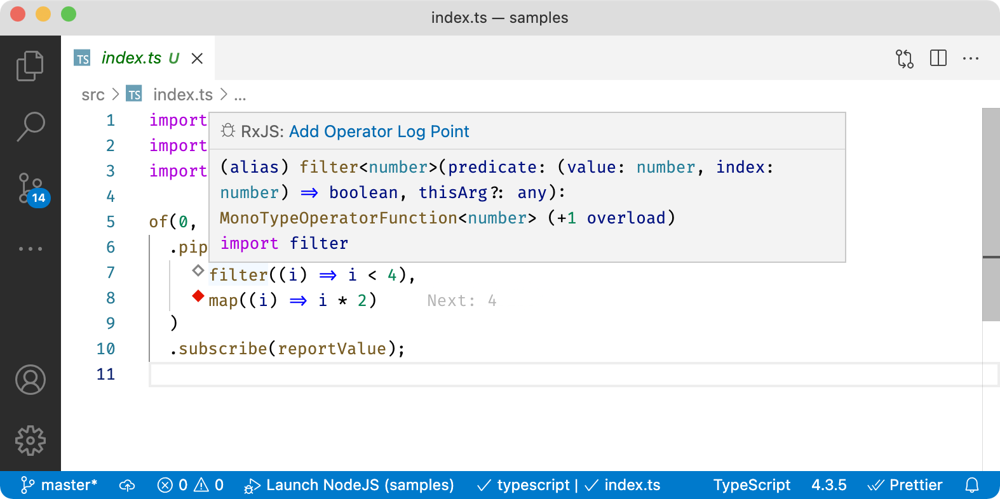

# Introduction

Debugging is an essential part of a software engineer's daily job. Various techniques, some better suited for the task than others, help engineers explore the functionality of an unknown or malfunctioning program. Rather traditional debugging is done by interpreting memory dumps or the analysis of log entries. Sophisticated debugging solutions hook into a program at runtime and allow more detailed inspection and control [@IEEE_Glossary_1990].

Imperative programming languages like Java, C#, and Python dominated the mainstream software engineering industry over the last decades [@Yaofei_Chen_Dios_Mili_Lan_Wu_Kefei_Wang_2005; @Meyerovich_Rabkin_2013]. Because of the prevalence of imperative programming languages, integrated development environments like Eclipse, the JetBrains platform, or Microsoft Visual Studio provide specialized debugging utilities specifically tailored to imperative programming languages. This results in an excellent, fully integrated developer experience, where tool-supported debugging is only a keypress away.

The developer experience degrades rapidly when software engineers use programming languages and tools based on different programming paradigms such as reactive programming. Because of this, engineers tend to use simpler, less adept debugging techniques instead.

During my master studies research, I examined the necessity of paradigm-specific debugging utilities when software engineers debug programs based on RxJS^[https://rxjs.dev/], a library for reactive programming in JavaScript. During my research, I explored how professionals debug RxJS programs, what tools and techniques they employ, and why they prefer to use print statements instead of specialized debugging utilities requiring them to switch contexts. In doing so, I identified a key factor for the success of a debugging tool: It needs to be *ready-to-hand*, or its users will not use it at all.

Based on the premise of *readiness-to-hand*, I designed and implemented a novel debugging utility for reactive programming. *Operator Log Points* are available as an extension for Microsoft Visual Studio Code and provide the, to my knowledge, first fully integrated debugging utility for RxJS. Using Human-Computer Interaction methods, I examined the developer experience of operator log points. I successfully verified that the new utility replaces manual print statements and does not require engineers to change context. Thereby I proof that a ready-to-hand debugger for reactive programming is feasible.

This summative thesis contextualizes my research results documented in two research papers. I will complete this introduction with an overview of relevant programming paradigms, reactive programming with RxJS, and the challenges reactive programming provides for debuggers tailored to imperative programming. Relevant work will be discussed in [@sec:related-work], followed by a synopsis of the complete research process and its results in [@sec:research-process]. [@sec:future-work] presents a list of opportunities for future work and highlights provisions taken to ensure the sustainability of the demonstrated results. Before the reader is left with the study of two research papers in the [Appendix @sec:research-papers], I will wrap up on the topic of debugging support for reactive programming with RxJS in [@sec:conclusion].

## Relevant Programming Paradigms

```{.include}
figures/paradigm-taxonomy.tex
```

On the way of producing the output for a given input, an imperatively implemented program keeps intermediate and final computational results in its state. The key concept of imperative programming languages like Java and C# is the assignment command. The assignment command modifies the programs state by changing the value assigned to a variable. Execution flow control commands, e.g., `if` and `while`, allow conditional and repeated execution of commands [@Watt_Findlay_Hughes_1990].

With a declarative programming language, computational results are carried explicitly from one program unit to the next instead of keeping them in extraneous state [@Hudak_1989]. The source code of a declaratively implemented program is the blueprint of *what* the program is expected to accomplish eventually. In contrast, its imperative sibling resembles the precise step-by-step instruction on *how* the expected result must be achieved.

The Functional (FP) as well as the Data-Flow Programming (DFP) paradigm belongs to the family of declarative languages.

FP languages (e.g., Haskell and Erlang) are based on the concept of function and expression evaluation: Flow control statements are replaced with recursive function calls and conditional expressions [@Hudak_1989; @Watt_Findlay_Hughes_1990]. Thus, a program's outcome results from its complete evaluation rather than its implicit state. With DFP, programs are modeled as directed graphs where a node represents an instruction of the program. The graph's edges describe how the data flows between its nodes [@Johnston_Hanna_Millar_2004]. Examples for DFP can be found in visual programming environments like Node-RED^[https://nodered.org/].

Reactive Programming (RP) combines FP and DFP. With RP, software engineers describe time-changing values and how they depend on each other using a Domain Specific Language (DSL) [@Salvaneschi_Mezini_2016]. By doing so, they model a data-flow graph. A runtime environment interprets this graph and establishes a deterministic system state by executing necessary (re-)computations [@Bainomugisha_Carreton_Cutsem_Mostinckx_Meuter_2013; @Alabor_Stolze_2020]. RP is usually not part of programming languages themselves. Instead, libraries and language extensions (e.g., Reactive for Haskell and REScala for Scala) provide RP features to their respective host programming language [@Elliott_2009; @Salvaneschi_Hintz_Mezini_2014].

## Reactive Programming with RxJS

RxJS provides RP features for JavaScript and TypeScript. It is an implementation of the ReactiveX API specification, where the *Observable*, "[..] a combination of the best ideas from the Observer pattern, the Iterator pattern, and functional programming" [@reactivex], is the core concept.

### Event Subscriptions{.unlisted .unnumbered}

With the Observer pattern [@gof], observers subscribe to the notifications of a subject. Subscribers of an RxJS observable subscribe to the events of an observable likewise. Observables produce the following three event types:

1. `next` events carry produced values, e.g., the result of an HTTP request
2. `complete` events indicate that the observable finished its work and will not emit any further events in the future
3. `error` events notify subscribers about an error that occurred and that the observable will not emit any more events

Observables are push-based; they actively call the callback handler of their subscribers^[The Iterator pattern is pull-based, thus a counterexample to the push-based observable: The consumer has to actively poll (i.e., *pull*) the iterators `next` function to fetch a value [@gof].].

### Operator Functions{.unlisted .unnumbered}

An operator function subscribes to a source observable, modifies its events, and projects them to a target observable. Operator functions are the most powerful, yet most complex tool when working with observables. [@lst:example-rxjs] demonstrates how two simple operators filter and map values provided by a source observable. More complex operators allow for sophisticated constructions: E.g., `mergeMap`^[https://rxjs.dev/api/operators/mergeMap] composes higher-order observables to a new observable, or `retryWhen`^[https://rxjs.dev/api/operators/retryWhen] recovers an observable after it emitted an `error` event.

```{
	#lst:example-rxjs
	.typescript
	caption="An observable emitting integers 1...8. Two operators process the integers before they are handed to the subscriber, which prints them to the console."
}
import { of, map, filter } from 'rxjs'

of(1, 2, 3, 4, 5, 6, 7, 8).pipe(
  filter(i => i % 2 === 0),       // Skip odd Integers
  map(i => i + 1),                // Add 1 to Integer
).subscribe(i => console.log(i)); // Logs: 3, 5, 7, 9
```

### Visualizing Observables with Marble Diagrams{.unlisted .unnumbered}

Marble diagrams visualize observables graphically. Such diagrams help understand the runtime behavior of an observable and its operators. Thus they are extensively used in the RxJS documentation.

[@fig:marble-diagram] shows the marble diagram for the observable implemented in [@lst:example-rxjs]. Please refer to [Appendix @sec:marble-diagram-syntax] for an in-depth look at the marble diagram syntax.

```{.include}
figures/marble-diagram.tex
```

## Debugging Challenges of Reactive Programming

[@lst:imperative-program] shows a reimplementation of [@lst:example-rxjs] using an imperative programming style. Software engineers use the debuggers built-in to their Integrated Development Environments (IDE) to follow the program's execution path. They pause the program's execution at a specific point of interest using breakpoints. Every time the debugger pauses program execution, the stack frame inspector provides details on what function calls lead to the execution of the current stack frame. Further, the values of all variables belonging to a stack frame are shown. Using the step controls, the engineers handle further program execution manually or resume "normal" execution eventually.

```{
	#lst:imperative-program
	.typescript
	caption="JavaScript program replicating Listing 1 using an imperative programming style."
}
for (let i = 1; i < 9; i++) {
  if (i % 2 === 0) {
    console.log(i + 1); // Logs: 3, 5, 7, 9
  }
}
```

Software engineers use the same imperative debugging techniques to debug RP programs like the one shown before in [@lst:example-rxjs]: E.g., they add a breakpoint to the anonymous function passed to the `map` operator on Line 5 and run the program.

Again, the debugger provides a stack trace once program execution halts. [@fig:rxjs-stacktrace] depicts the debugger's major shortcoming when used with an RP program: The stack trace does not match the model of the data-flow graph described with the DSL. Instead, it reveals the inner, imperative implementation of RxJS' RP runtime. The debugger's step controls are ineffective since they operate on the imperative level as well. In this example, stepping to the following statement does not result in the debugger halting at Line 6. Instead, it leads the engineer to the internal implementation of RxJS.

{#fig:rxjs-stacktrace width=90%}

A common practice to overcome this problem is the manual augmentation of the source code with print statements, as shown in [@lst:rp-program-with-print-statements]. This technique is often the last resort to debug RxJS programs. However, it is also regarded as a cumbersome and time consuming practice [@Alabor_Stolze_2020].

```{
	#lst:rp-program-with-print-statements
	.typescript
	caption="RxJS-based program from Listing 1 manually augmented with print statements."
}
import { of, filter, map, tap } from 'rxjs';

of(1, 2, 3, 4, 5, 6, 7, 8).pipe(
  tap(i => console.log(`A: ${i}`)), // <-- Added
  filter(i => i % 2 === 0),
  tap(i => console.log(`B: ${i}`)), // <-- Added
  map(i => i + 1),
  tap(i => console.log(`C: ${i}`))  // <-- Added
).subscribe(i => console.log(i));
```

\clearpage

# Related Work {#sec:related-work}

## Reactive Debugging

The problem of imperative debuggers interpreting RP source code using the wrong model was subject to research efforts before. Salvaneschi et al. [@Salvaneschi_Mezini_2016, @Salvaneschi_Proksch_Amann_Nadi_Mezini_2017] coined the term *Reactive Debugging* and described a debugging utility specifically tailored to work with RP programs for the first time in their work. They provided the first implementation of such a debugger named *Reactive Inspector* for REScala.

Banken et al. [@Banken_Meijer_Gousios_2018] transferred former findings to RxJS. *RxFiddle* is a browser-based visualizer that takes a piece of isolated RxJS source code and displays its runtime behavior in two dimensions: A flow-graph shows all observables that get created and how they depend on each other. Additionally, the utility uses marble diagrams to show what events get emitted by an observable over time.

## Debugging as a Process

Layman et al. [@Layman_Diep_Nagappan_Singer_Deline_Venolia_2013] looked into how engineers debug programs. They formalized an iterative process model for the activity of debugging. During this process, engineers define and refine a hypothesis on the cause that triggered an unexpected behavior in a program. Ultimately, the process tries to validate that hypothesis. The debugging process after Layman et al. consists of three steps: Engineers start to (i) collect context information on the current situation (e.g., which particular program statements might be involved or what input caused the failure). This information then allows the software engineers to formulate a hypothesis on how the failure situation might be resolved. Next, they (ii) instrument the program, e.g., by adding breakpoints or modifying source code. They then (iii) test the instrumented program to validate their hypothesis. Step iii either proves their hypothesis correct, ending the debugging process, or yields new information for another iteration of hypothesis refinement and testing.

## Developer Experience

Human-Computer Interaction (HCI) is the scientific examination of the interface between people and computers. HCI employs empirical research methods to review and verify the design of such interfaces [@Lazar_Feng_Hochheiser_2017].

While HCI is an academic research discipline, User Experience (UX) design is a more practice-oriented subject and draws from many tools originated in HCI. The International Organization for Standardization (ISO) defines UX as "a person's perceptions and responses that result from the use or anticipated use of a product, system or service" [@iso_ux_2010].

Developer Experience (DX) is the umbrella term for the application of UX design principles and methodologies like User-Centered Design (UCD) [@Goodwin_2009] specifically for developers and software engineers [@Fagerholm_Munch_2012; @Nadeem_2021].


# Research Process {#sec:research-process}

```{.include}
figures/research-process.tex
```

The research process is structured in four phases: (i) Exploration, (ii) Proof of Concept (PoC), (iii) Prototype, and (iv) Distribution. Methods originated in the fields of empirical software engineering [@wohlin2012experimentation] and HCI helped to verify the main artifacts listed in [@tbl:artifact-overview]. The following four subsections highlight the most important results and deliveries of each project stage.

```{.include}
tables/artifact-overview.tex
```

## Exploration

I started with an analysis of what debugging tools and techniques software engineers use in their daily jobs. Data from five informal interviews and five written "war story" reports allowed me to build a first intuition in these regards. To verify the collected data, I set up a remote observational study with four subjects. In the study, two malfunctioning RxJS programs were presented and the subjects were asked to locate and fix the problems in the applications source code. To do so, they should use the debugging utilities they would use in their daily jobs as well. [@fig:result-observational-study] summarizes the results. All subjects used manual code modifications (i.e., print statements) to understand the behavior of the presented problems. Over half of them tried to use the imperative debugger of their IDE. The most pivotal insight was that, even though two subjects stated to know about specialized RxJS debugging tools, none of them used such during the study.

```{.include}
figures/result-observational-study.tex
```

The results of the interviews, the analysis of the war story reports, and the interpretation of the observed behaviors during the observational study lead to the following two key take-aways:

1. The most significant challenge software engineers face when debugging RxJS-based programs is to know *when* they should apply *what* tool to resolve a problem the *best* way
2. Since engineers abstained from using specific RxJS debuggers, how can such utilities be provided without requiring them to switch context, thus be ready-to-hand?

I documented these results in the research paper "Debugging of RxJS-Based Applications" together with Markus Stolze [@Alabor_Stolze_2020]. The paper was published with the proceedings of the 7th ACM SIGPLAN International Workshop
on Reactive and Event-Based Languages and Systems (REBLS' 20), where I also presented my findings. Furthermore, the published paper is available in [Appendix @sec:paper-1].

## Proof Of Concept

Based on the learnings from the first phase, I started to compile ideas to help software engineers debug RxJS programs. It was essential that a potential solution:

1. Integrates seamlessly with an IDE
2. Is ready-to-hand, i.e. requires minimal to no effort from its users to get started with debugging

McDirmid [@McDirmid_2013] proposed with the concept of "probes" for live programming environments a way to trace variable values during runtime directly in the source code editor. Similarly, imperative debuggers provide log points, a special type of "breakpoint". Instead of halting the program, they print an arbitrary log entry to the debugging console. Using the debugging process by Layman et al. [@Layman_Diep_Nagappan_Singer_Deline_Venolia_2013] as a mental model, I combined the two concepts and transferred them to the world of RP debugging: The *operator log point*^[Inspired by McDirmid [@McDirmid_2013], operator log points were called *probes* in the PoC and the early prototype of the extension. This name caused confusion with the test subjects in a later usability test. I renamed the utility based on the received feedback in turn.] shows the events emitted by an operator during program execution in realtime.

After establishing the PoC for operator log points as an extension for Microsoft Visual Studio Code (vscode), I used the cognitive walkthrough method [@Wharton_Rieman_Clayton_Polson_1994; @Lazar_Feng_Hochheiser_2017] to verify the utility. Its results, available as part of [Appendix @sec:paper-2-supplementary], demonstrated that the proposed debugging utility replaces manual print statements in a scenario where engineers debug RxJS programs.

To convey the achieved improvement through operator log points effectively, I created a "comparative user journey." A basic user journey maps the touchpoints of a user with a product [@richardson2010using]. In my comparative journey, I correlate how a software engineer would solve a typical RxJS debugging task with an imperative debugger compared to an engineer having operator log points at their disposal. The result is available in [Appendix @sec:user-journey].


## Prototype

Certain that operator log points satisfy all requirements defined in the previous stage of the process, I started with the actual implementation work for a production-ready vscode extension. Eventually, I released version 0.1.0 of "RxJS Debugging for vscode".

{#fig:prototype width=90%}

The prototype of the extension enabled engineers to debug RxJS-based applications running with Node.js. After they installed the extension, the debugger started to suggest operator log points with a small, diamond-shaped icon next to the respective operator. Next, the engineer launched their application using vscode's built-in JavaScript debugger. The RP debugger automatically augmented RxJS so it started to send event telemetry to vscode. The extension then displayed events (e.g., "Next: 4" in [@fig:prototype] at the end of Line 8) for enabled operator log points in-line with the respective operator in the source code editor.

There were various challenges and tasks to solve during the Prototype phase. The following two sections present two highlights.

### Communication with Node.js

One of the biggest challenges in implementing the prototype was to build a reliable way to communicate with RxJS running inside the Node.js process. I initially used a WebSocket to exchange messages with the JavaScript runtime. However, this proved to be prone to problems in numerous ways. E.g.:

- How should the extension discover the WebSocket server running in the other process?
- What if the network infrastructure prevents vscode from connecting to the WebSocket in the first place?
- Would a WebSocket-based solution work at all, when RxJS is running in a browser?

I decided to replace the WebSocket-based communication with something more suitable eventually.

With the intent to build a debugger that integrates with the IDE seamlessly, I looked into how vscode's built-in JavaScript debugger, vscode-js-debug^[https://github.com/microsoft/vscode-js-debug], communicates with the runtime environment. As it turned out, vscode-js-debug uses the Chrome DevTools Protocol^[https://chromedevtools.github.io/devtools-protocol/] (CDP) to communicate with arbitrary JavaScript runtimes. Unfortunately, the debugger did not offer its CDP connection for reuse to other extensions. I reached out to the project maintainer and contributed this particular functionality as a new feature ([Appendix @sec:cdp-pull-request]). By the time my contribution was released in April 2021, I had replaced the previous WebSocket-based communication channel with CDP. Furthermore, I had now a future-proof solution, which not only worked with RxJS running inside of a Node.js process, but also in any other JavaScript virtual machine that supports CDP (e.g., web browsers like Mozilla Firefox and Google Chrome).

[@fig:architecture] depicts all relevant components involved in an RxJS RP debugging session. More details to the extensions architecture is available in [Appendix @sec:architecture].

```{.include}
figures/architecture.tex
```

### Moderated Remote Usability Test

Once the main elements of the prototype were working sufficiently, I conducted a remote usability test [@Nielsen_Participants_1994; @Boren_Ramey_2000; @Norgaard_Hornbaek_2006; @Lazar_Feng_Hochheiser_2017] with three subjects. The goals of this study were:

1. To verify that operator log points can replace manual print statements in an actual programming scenario
2. To identify usability issues not detected during development
3. To collect unstructured feedback on prototype and gather ideas for its further development

Unfortunately, one subject could not get the extension prototype running on their machine. With the other two subjects left, I was able to verify the first two goals nonetheless. None of the participants used manual print statements during the usability test. Additionally, the evaluation of the test sessions revealed ten usability issues. Four of them prevailed for both subjects, hence I classified them as major. The complete list of identified usability issues is part of [Appendix @sec:paper-2-supplementary].

I triaged the feedback from all three subjects and created items in the feature backlog for the upcoming Distribution phase accordingly. With this, the last goal was reached as well.


## Distribution

The last process phase had two overarching goals:

1. To finalize the RP debugger prototype and release it to the community
2. To publish another research paper documenting the feasibility of a ready-to-hand, and fully IDE-integrated RP debugger

To get started, I defined the roadmap for the extensions 1.0.0 release, which is available in [Appendix @sec:major-milestone]. The following list contains three of its highlights:

- Support for the latest RxJS 7.x versions (only 6.6.7 was supported with the prototype)
- Debugging of web applications bundled with Webpack (only the Node.js virtual machine was supported so far)
- Resolve the four major usability issues identified during the Prototype stage

Version 1.0.0 of "RxJS Debugging for vscode" was finally released on the 2nd of December 2021 and was followed by three minor bugfix releases within six days.

### Community Reception

On the day of release, I announced the debugger extension via its own Twitter account [\@rxjsdebugging](https://twitter.com/rxjsdebugging). Until the 30th of December 2021, the tweet reached 77k impressions ([Appendix @sec:release-tweet-stats]). \clearpage Further, the extension was downloaded 954 times ([Appendix @sec:marketplace]), counted 51 unique users ([Appendices @sec:analytics; Appendices @sec:analytics-dashboard]), and was featured in a live stream on Twitch^[David Müllerchen aka [\@webdave_de](https://twitter.com/webdave_de), a Google Developer Expert specialized on Angular development, hosted the live reaction stream on Twitch. Unfortunately, the recording of the stream is unavailable at this time.].

Based on the results of the studies conducted before, I concluded that there was a real need for an integrated RP debugger for RxJS. The overall positive reception on RxJS Debugging for vscode was overwhelming nonetheless. However, the major release also revealed bugs and feature gaps in the extension. Nevertheless, I resolved the most critical problems within a few days (see the changelog in [Appendix @sec:changelog]). In addition, I processed feedback using GitHub Discussions^[https://github.com/swissmanu/rxjs-debugging-for-vscode/discussions] and the feature backlog ([Appendix @sec:feature-backlog]).

### ISSTA `22 Research Paper

In contrast to the delivered practical effort, I wrote another research paper with Markus Stolze. The paper documents the latest advancements on the feasibility of an RP debugger that is ready-to-hand and fully integrated with an IDE. The latest version of this paper was submitted to the technical papers track of the 31st ACM SIGSOFT International Symposium on Software Testing and Analysis 2022 (ISSTA `22) at the time of publishing this thesis. The submitted paper includes revisions based on the feedback of a double-blind review with three reviewers and is available in [Appendix @sec:paper-2].

# Future Work {#sec:future-work}

## Empirical Software Engineering

```{.include}
figures/validation-step.tex
```

RxJS Debugging for vscode provides a practical solution to the problems identified throughout the presented research process, and further empirical validation can now be carried out.

Operator log points were successfully tested using HCI methods during their development. However, a formal verification using empirical methods will yield useful insight into the presented debugging utility. The most important research question to answer in these regards is, how effectively operator log points can replace existing debugging tools (i.e., manual print statements and the built-in, imperative debugger tools).

With its major release, the debugging extension asks its users to opt-in for the anonymized collection of user behavior data. This data is available for further analysis as described in [Appendix @sec:analytics]. The accumulated data points allow conclusions on how software engineers use the extension. The data set might be evaluated on its own to derive improvements for the presented debugging utility or provide supportive arguments for a broader study as proposed above.

### Open Science

All conducted studies (interviews, observational study, cognitive walkthrough and moderated remote usability test) and their results are documented in the respective research papers and their supplementary material available in [Appendices @sec:paper-1; Appendices @sec:paper-2; Appendices @sec:user-journey] to encourage future research on RP debugging. In addition, a list of URLs leading to various GitHub repositories containing relevant artifacts and data sets is available in [Appendix @sec:open-science].

## Open Source

I developed the presented RxJS debugging extension with the intention to establish a sustainable open source project.

Three guides introduce new contributors to the project and to the extension's implementation and code organization details ([Appendices @sec:contributing; Appendices @sec:code-of-conduct; Appendices @sec:architecture]). The transparent project governance is built around the GitHub platform: The feature backlog and bug-tracking is based on GitHub Issues, Discussions help triage inquiries from users. Unit and integration tests, automatically executed using GitHub Actions, help keep the extension's main branch stable.

The feature backlog in [Appendix @sec:feature-backlog] contains ideas for practical-oriented future work. I present two features from this backlog in the following.

### User Onboarding after Installation ([Issue #58](https://github.com/swissmanu/rxjs-debugging-for-vscode/issues/58))

After an engineer installed the extension, they are left on their own to get started with debugging. Even though the readme file provides information to some extent, the onboarding experience for new users can be improved. With this feature, ways to enhance that experience should be explored and suitable measures be implemented eventually.

A contributor needs to understand the vscode extension API. However, profound knowledge of the extension's own source code is not required.

### Log Point History ([Issue #44](https://github.com/swissmanu/rxjs-debugging-for-vscode/issues/44))

Instead of showing only the latest emitted event from an enabled operator log point, the debugger should display all previously emitted events. This functionality would allow engineers to reconstruct the behavior of an operator without over and over replaying the failure scenario using the live system.

A contributor may start simply by implementing a list to display historical events in textual form. The list might then be gradually improved towards a graphical representation of the events using marble diagrams ([Appendix @sec:marble-diagram-syntax]).

This feature requires a good understanding of the vscode extension API and in-depth knowledge of the debugging extensions codebase. However, all event data to populate a historical view is already present, and contributors can focus on implementing the best possible DX.


# Conclusion {#sec:conclusion}

In this summative thesis, I presented the condensed results of my research on reactive debugging for programs based on RxJS, a popular library for reactive programming with JavaScript.

The results of interviews, war story reports, and an observational study revealed the major shortcoming of previously available RxJS debugging utilities. Even though software engineers might know them, they abstain from using them because they are not "ready-to-hand," i.e., not integrated with the development environment they are working in and accustomed to. Instead, they use manual print statements.

With the concept of "readiness-to-hand" as a guiding light, I built a proof of concept implementation for a novel debugging utility to find relief from this problem: Operator log points debug RxJS operators without requiring the engineer to leave Microsoft Visual Studio Code. While refining the debugger iteratively, I employed a cognitive walkthrough, a comparative user journey, and a usability test at different stages of development to validate the utility's capability of solving the problem of ready-to-hand reactive debugging.

I documented the results of my research together with Markus Stolze in two research papers: The first paper was published with the proceedings of the ACM REBLS '20 workshop. The second report is in review for the technical papers track of the ACM ISSTA '22 conference when publishing this thesis. Furthermore, I released "RxJS Debugging for Visual Studio Code," the, to my knowledge, first RxJS-specific debugger that fully integrates with a development environment at the end of 2021.

By providing open access to all relevant material (studies, results, papers, source code, and project governance), academical- and practical-oriented future work is encouraged. To further facilitate potential contributions, I suggested concrete topics for researchers and engineers likewise.
